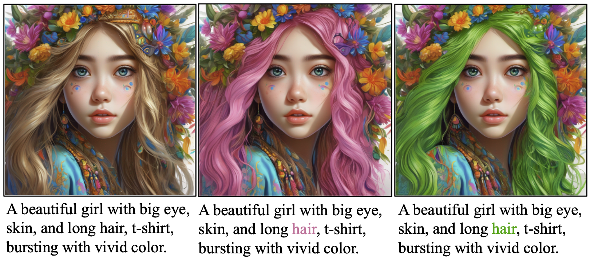
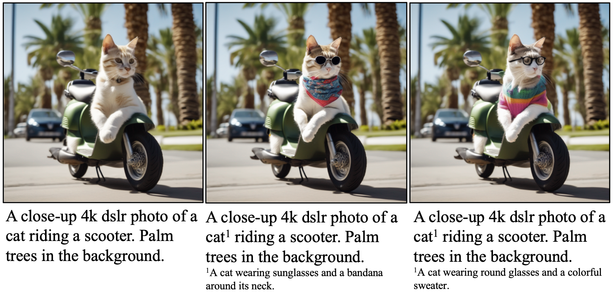
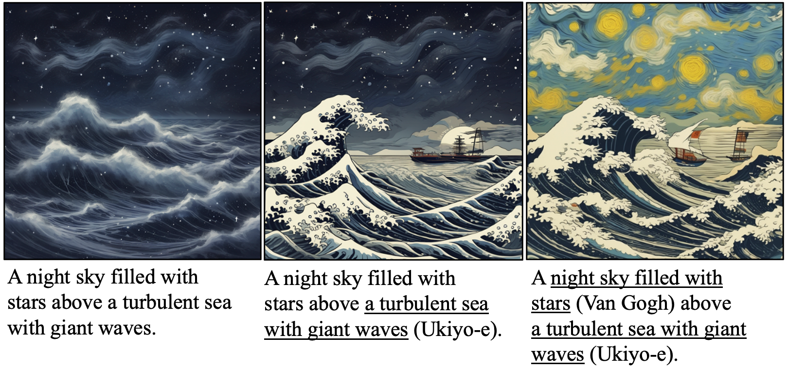
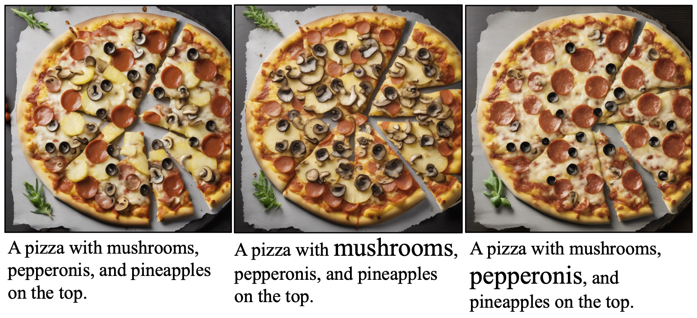

# Rich-Text-to-Image for Stable Diffusion WebUI
#### [Project Page](https://rich-text-to-image.github.io/) | [Paper](https://arxiv.org/abs/2304.06720) | [Code](https://github.com/songweige/rich-text-to-image) | [HuggingFace Demo](https://huggingface.co/spaces/songweig/rich-text-to-image) | [Video](https://youtu.be/ihDbAUh0LXk)

The WebUI extension for integrating a rich-text editor for text-to-image generation.

This extension is for [AUTOMATIC1111's Stable Diffusion web UI](https://github.com/AUTOMATIC1111/stable-diffusion-webui), allows the Web UI to add [rich-text-to-image](https://rich-text-to-image.github.io/) to the original Stable Diffusion model to generate images. 

## Installation

1. Open "Extensions" tab.
1. Open "Install from URL" tab in the tab.
1. Enter URL of this repo (https://github.com/songweige/sd-webui-rich-text) to "URL for extension's git repository".
1. Press "Install" button.
1. Restart Web UI.

## Usage

The extension now supports [SD-v1.5](https://huggingface.co/runwayml/stable-diffusion-v1-5) (default), [SD-XL-v1.0](https://huggingface.co/stabilityai/stable-diffusion-xl-base-1.0), and [ANIMAGINE-XL](https://huggingface.co/Linaqruf/animagine-xl). The checkpoints will be automatically downloaded when the model is first selected.

#### Font Color

Font color is used to control the precise color of the generated objects. 

#### Footnote

Footnotes provide supplementary descriptions for selected text elements. 

#### Font Style

Just as the font style distinguishes the styles of individual text elements, it is used to define the artistic style of specific areas in the generation.

#### Font Size

Font size indicates the weight of each token in the final generation.

## Acknowledgement

The extension is built on the [extension-templates](https://github.com/udon-universe/stable-diffusion-webui-extension-templates). The rich-text editor is built on [Quill](https://quilljs.com/). The model code is built on [huggingface / diffusers](https://github.com/huggingface/diffusers#readme).
